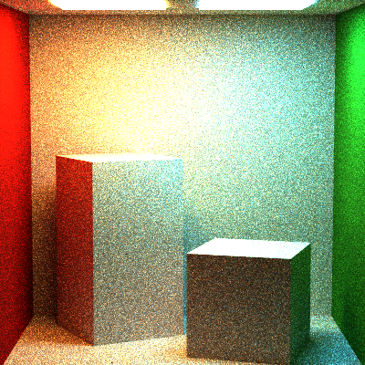
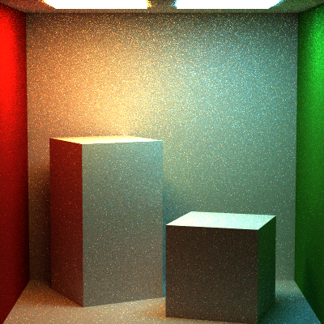

Path Tracer Episode V: Global Illumination Strikes Back
======================

**University of Pennsylvania, CIS 561: Advanced Computer Graphics, Homework 7**

Overview
------------
You will revise your implementation of the `FullLightingIntegrator` so that it
produces mathematically correct results. In the previous assignment, the method
of global illumination path tracing we had you implement _seemed_ correct, but
was in fact only correct for scenes containing one light source. Observe the
difference in the following two images: the image on the left is much brighter
and noisier than the one on the right, and this is because it was produced using
the incorrect method of global illumination weighting performed in the previous
assignment.

 

Useful Reading
---------
Once again, you will find the textbook will be very helpful when implementing
this homework assignment. We recommend referring to the following chapters:
* 14.5: Path Tracing

The Light Transport Equation
--------------
#### Lo(p, &#969;o) = Le(p, &#969;o) + &#8747;S f(p, &#969;o, &#969;i) Li(p, &#969;i) V(p', p) |dot(&#969;i, N)| _d_&#969;i

* __Lo__ is the light that exits point _p_ along ray &#969;o.
* __Le__ is the light inherently emitted by the surface at point _p_
along ray &#969;o.
* __&#8747;S__ is the integral over the sphere of ray
directions from which light can reach point _p_. &#969;o and
&#969;i are within this domain.
* __f__ is the Bidirectional Scattering Distribution Function of the material at
point _p_, which evaluates the proportion of energy received from
&#969;i at point _p_ that is reflected along &#969;o.
* __Li__ is the light energy that reaches point _p_ from the ray
&#969;i. This is the recursive term of the LTE.
* __V__ is a simple visibility test that determines if the surface point _p_' from
which &#969;i originates is visible to _p_. It returns 1 if there is
no obstruction, and 0 is there is something between _p_ and _p_'. This is really
only included in the LTE when one generates &#969;i by randomly
choosing a point of origin in the scene rather than generating a ray and finding
its intersection with the scene.
* The __absolute-value dot product__ term accounts for Lambert's Law of Cosines.

Updating this README (5 points)
-------------
Make sure that you fill out this `README.md` file with your name and PennKey,
along with your test renders. You should render each of the new scenes we have
provided you, once with each integrator type. At minimum we expect renders using
the default sample count and recursion depth, but you are encouraged to try
rendering scenes with more samples to get nicer looking results.

Removing your old `Li` code
---------
To begin, we recommend taking all of the code that you wrote for
`FullLightingIntegrator::Li` in the previous assignment and either commenting
it out or moving it somewhere else. You _will_ use some of this code again, but
the overall implementation of `Li` will be significantly altered.

An iterative implementation of `FullLightingIntegrator::Li` (15 points)
--------------
In order to more easily track certain pieces of information, such as the
cumulative throughput of your ray path and whether or not your ray just bounced
off a specular surface, we are going to implement the `FullLightingIntegrator`'s
`Li` function using a `while` loop rather than having it invoke itself
recursively. To begin, your `Li` should instantiate an accumulated ray color
that begins as black, and an accumulated ray throughput color that begins as
white. The throughput will be used to determine when your ray path terminates
via the Russian Roulette heuristic. Next, simply declare a `while` loop that
compares some current depth value to 0, assuming that depth began as the maximum
depth value. Within this loop, we will add a check that breaks the loop early
if the Russian Roulette conditions are satisfied. Just after this `while` loop,
your `Li` code should return the accumulated ray color, which will be computed
within the loop.

Computing the direct lighting component (20 points)
----------
Using almost the same code as you wrote for the previous assignment, use
multiple importance sampling to evaluate the direct lighting your ray
intersection receives from a randomly chosen light source. This value will be
__one__ term; if your BSDF-generated ray does not hit the light source you
randomly chose, then its contribution will be black. This term should NOT
include any global illumination light, or any light from any other light source.
As in your `DirectLightingIntegrator`, make sure to scale the direct lighting
contribution by the number of light sources in your scene; since you are
sampling each light source at a frequency inversely proportional to the number
of lights in the scene, you must scale each light's contribution upward to
counteract its otherwise lessened contribution.

Similarly to your `DirectLightingIntegrator`, we are going to treat the direct
lighting contribution of specular surfaces as black. While the term we'd obtain
from the BSDF-based sample would _not_ actually be black, we perform a slightly
less costly BSDF contribution computation below, so we're just going to ignore
the direct lighting term entirely when it comes to specular materials.

Computing the ray bounce and global illumination (15 points)
-------
Separately from your direct lighting term, you should use an entirely new
2D uniform random variable to generate a new BSDF-based &#969;i using
`Sample_f`. You will multiply the color obtained from `Sample_f` with your ray
throughput, along with the absolute-dot-product term and the 1/_pdf_ term. This
effectively compounds the inherent material colors of all surfaces this ray has
bounced from so far, so that when we incorporate the lighting this particular
ray bounce receives _directly_, it is attenuated by __all__ of the surfaces our
ray has previously hit. To this end, once you have your updated throughput,
multiply it with the direct lighting term from above and add the result to
your accumulated ray color. Finally, make sure to update the ray that your
`while` loop is using to originate from your current intersection and travel
in the direction of the &#969;i that you just computed.

Correctly accounting for direct lighting (10 points)
-------
Since your path tracer computes the direct lighting a given intersection
receives as its own term, your path tracer must __not__ include _too much_
light. This means that every ray which already computed the direct lighting term
should __not__ incorporate the `Le` term of the light transport equation into
its light contribution. In other words, unless a particular ray came directly
from the camera or from a perfectly specular surface, `Le` should be ignored.

Russian Roulette Ray Termination (10 points)
-------
This component should be identical to your implementation from the previous
assignment. After you compute the direct lighting and indirect lighting terms,
compare the maximum RGB component of your throughput to a uniform random number
and stop your `while` loop if said component is smaller than the random number.
Most importantly, to keep your path tracer mathematically correct, you must then
divide your throughput by the maximum component of your throughput; this scales
up the contribution of this ray path proportionally to how likely the path is
to terminate so that we are still accounting for the contribution that paths
that _were_ terminated earlier would have had.

Custom scenes (30 points)
-----------
Since you are primarily re-implementing code from last week, you will have time
available to design and render scenes of your own design. Unlike last week,
these scenes are a required component of this assignment. Please create and
render __at least three__ unique scenes. They should not be variations on the
Cornell box! We want you to have unique material for your demo reel (and some
first-hand experience working with the JSON format we have made for scenes).
We expect each scene to be rendered with a __minimum of 20x20 samples per
pixel__ and with a __hard recursion limit of 8 bounces__ (though your Russian
Roulette may stop it earlier). Additionally, each image should be a __minimum
of 512x512 pixels__, but at least one larger image is recommended for better
demo reel quality.

We ask that your custom scenes showcase the more visually impressive components
of your path tracer, such as a scene that includes a microfacet mirror surface
and several glass materials of various indices of refraction. Additionally,
texture maps, normal maps, and microfacet roughness maps are encouraged. You may
try to render scenes containing triangle meshes, but bear in mind that they will
take a while if your meshes have a high number of faces.

In preparation for the next assignment
------------
Since this homework assignment is on the shorter side, I'd like you to spend
some time reading ahead for the next homework assignment, which will involve
implementing a bounding volume hierarchy acceleration structure for your path
tracer in order to more efficiently render scenes with large numbers of objects,
such as any scene containing a triangle mesh. So, please read the following by
next Monday:
* Chapter 4.2: Aggregates
* Chapter 4.3: Bounding Volume Hierarchies
* Chapter 4.4: Kd-Tree Accelerator

Example Renders
--------
We have provided you one extra test scene: `PT_cornellBoxTwoLights.json`. Below
is a render using 100 samples per pixel and a hard recursion limit of 5:

Extra credit (30 points maximum)
-----------
Choose any extra credit from a previous path tracer homework assignment and
implement it, provided of course that you did not previously do so. As always,
you are free to implement a feature not listed as extra credit if it is not a
required feature of some other assignment, e.g. a subsurface scattering BXDF.

Submitting your project
--------------
Along with your project code, make sure that you fill out this `README.md` file
with your name and PennKey, along with your test renders.

Rather than uploading a zip file to Canvas, you will simply submit a link to
the committed version of your code you wish us to grade. If you click on the
__Commits__ tab of your repository on Github, you will be brought to a list of
commits you've made. Simply click on the one you wish for us to grade, then copy
and paste the URL of the page into the Canvas submission form.
